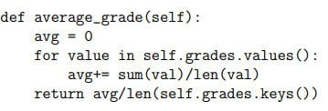
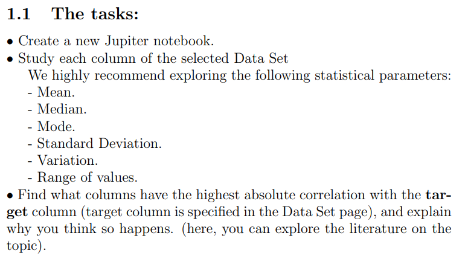
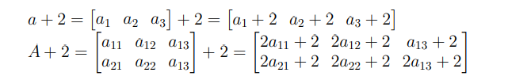
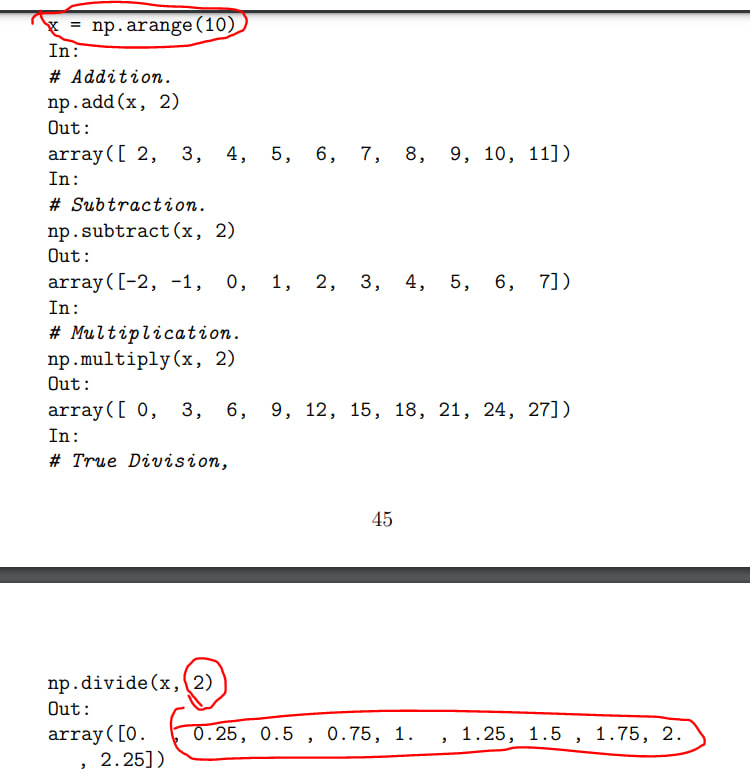

# Feetback
- Destul de bine e redata informatia - **scurt**, **clar** si **cuprinzator**! imi este interesant sa citesct, luand in considerare cat de rar eu citesc ceva carti 

- ## OOP
  1. In cod este gresela ---> La crearea **for loop** este initializata variabila `value`. Iar in blocul de cod a lui **for loop** se utilizeaza variabila `val`, care nu este nici unde initializata. 

  2. In subcapitolul **What are the key concepts of the OOP?**, punctul **Inheritance** ---> Lipseste explicatie la metoda `.super()`. Dupa parerea mea asta tot e o parte din mostenire si ar trebui sa fie.

  3. La sfarsitu\l subcapitolui **What are the key concepts of the OOP?**, punctul **Inheritance** ---> Se zice pentru a face **incapsularea protectata**, trebuie de utilizat doar un `_` in fata unei metode sau atribut. Iar acest concept in python nici nu este realizat si metoda aceasta nu lucreaza pentru ca metoda/atributul nu se face de loc privata, o pot accesa si din afara clasei.

- ## Pandas
  1. Lipsesc exemple de **output** pentru metodele, `.mean()`, `.median()`, `mode()`, **etc.**
  
  2. Lipseste la unele **statistical parameters** explicatie in cartea precedenta, unde se explica, spre exemplyu **Range of values** 

- ## Numpy
  1. La explicarea operatiilor cu matrice am intalnit o greseala ---> Se arata Matrita `A_2x3 + 2`, si dupa se arata intrepretarea aceastuia in formula, dar
in fata la fiecare parametru a adaugat cifra `2` - Ce inseamna ca inmulteste `2` cu elementul dat(Dar in formula matematica e doar adunare, fara inmultire), iar pe index-ul `a_1,3` acest `2` lipseste. 
  
  2. La unele metode/functii nu sunt explicate functionalul ---> `.arange()`, `.reshape()`, **etc.** nu deodata am realizat ce fac.

  3. Impartire este efectuata gresit <--- Eu presupun ca aceasta greseala a fost creata in modul urmator:  
     - Exemplul cu operatii python(`/`), nu numpy(`.divide()`) - A fost efectuata impartire la aceiasi matrice, dar cu cifra `4`. Si dupa a fost copiat rezultat-ul din exemplu acesta si pus la exemplul de mai jos cu impartire din numpy `.divide()` 

# Ask

- ## OOP
  1. In subcapitolul **What are the key concepts of the OOP?**, punctul **Polymorphism** <--- Ce face aceasta, nu am inteles cam de loc, care e functionalul lui si ce deosebit face si la ce se foloseste **?**

- ## Pandas
  1. E nevoie sa citesc acuma [cartea care sa recomendat](https://jakevdp.github.io/PythonDataScienceHandbook/) la sfarsitul capitolului **Pandas**, ori pe parcurs **?**

- ## WordBook
  1. E necesar la moment sa inteleg tot ce se zice in explicari pentru ce e oare care functie din **ML**(`MSE`, `Sigmoid`, **etc.**)? Eu nu cam am inteles majoritatea din ele.
